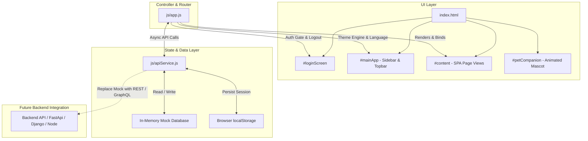

# Project Memory: KODE Sports Club — Employee Hub

> **Single Source of Truth** for technical architecture, user directory, module topography, and backend integration guide. Preserves full context across sessions and machines.

---

## 1. Executive Summary & Business Logic

- **Core Purpose:** A high-performance, single-page intranet portal (SPA) built for KODE Sports Club employees to access daily news, club events, department workspaces, organizational hierarchies, monthly peer awards/gamification, and animated companion assistance.
- **Target Audience & Roles:**
  1. **Admin / HR (`Admin`, `HR`):** Full control over employee roster, department creation/assignment, role permissions, and awards oversight.
  2. **Managers (`Manager`):** Award monthly points to department team members, monitor department discussions, and view reporting hierarchies.
  3. **Employees (`Employee`):** Passwordless authentication, private department workspace, department-filtered news & events calendar, peer award tracking (Trophy Room), and threaded discussions.
- **Key Business Flows:**
  - **Passwordless Single Sign-On (SSO):** Employee enters their registered name or email &rarr; System validates against active registry &rarr; Session is stored in `localStorage` &rarr; Hub loads customized by department.
  - **Department Isolation:** Employees only see their own department's workspace and filtered feeds, plus company-wide "General" announcements.
  - **Monthly Award System:** Managers nominate one employee per month with criteria and points, updating the employee's trophy balance in real time.

---

## 2. Active User Directory & Initial Roster

| ID | Name | Email / Identifier | Role | Department | Avatar | Initial Points |
|---|---|---|---|---|---|---|
| **1** | **Malak Hussein** | `malak@kode.club` / `Malak Hussein` | `Admin` | `Marketing` | `MH` | 50 pts |
| **2** | **Ahmed Samy** | `samy@kode.club` / `Ahmed Samy` | `HR` | `HR` | `AS` | 0 pts |
| **3** | **Sara Ali** | `sara@kode.club` / `Sara Ali` | `Manager` | `Marketing` | `SA` | 100 pts |
| **4** | **Omar Khaled** | `omar@kode.club` / `Omar Khaled` | `Employee` | `Tech` | `OK` | 0 pts |

### Departments Available:
- `HR`
- `Tech`
- `Safety`
- `Food Safety`
- `Marketing`
- `PR`
- `Community`
*(HR/Admin can add new departments dynamically)*

### System Roles:
- `Admin` (Full system privileges)
- `HR` (Department & employee roster management)
- `Manager` (Award giving & hierarchy leadership)
- `Employee` (Standard workspace access)

---

## 3. System Architecture & Technical Design

### Tech Stack
- **Frontend Core:** Pure HTML5, Vanilla JavaScript (ES6+ Async/Await), Vanilla CSS3 (Custom Properties & Glassmorphism).
- **Icons & Typography:** Google `Material Symbols Outlined`, `Montserrat` (Headers/Body), `Cairo` (RTL Arabic support).
- **State Management:** Decoupled Mock Service layer (`js/apiService.js`) with `localStorage` persistence.
- **Portability:** Zero external build steps (`node_modules` not required for dev). Runs on any static file server (`python -m http.server 8080`, Nginx, Vercel, Live Server).

### Architectural Layers



---

## 4. Module Interconnections & File Map

### Key Files
1. **`index.html`**
   - Holds the main layout containers: `#loginScreen`, `#mainApp`, `#content`, `#modal`, `#drawer`, and `#petCompanion`.
   - Imports fonts (`Montserrat`, `Material Symbols`) and cache-busted scripts.
2. **`css/styles.css`**
   - Contains the Stitch Design System, dark/light theme CSS variables (`--bg`, `--card`, `--ink`, `--primary`, etc.).
   - Pure CSS ambient background (`.app-bg`), frosted glass panels (`.glass-panel`), and swipe animations.
3. **`js/apiService.js`**
   - Central Mock API interface. Exposes Promise-based methods for all CRUD operations.
   - **This is the single file to modify when connecting to a real backend.**
4. **`js/app.js`**
   - SPA Router (`go(page)`), View Renderers (`home()`, `newsPage()`, `eventsPage()`, `departmentPage()`, `adminPage()`, etc.).
   - Swipe gesture controller (`bindFeedSwipe()`), modal managers, and role switcher dev tool.

---

## 5. Backend API Integration Guide (How & Where to Connect Real APIs)

To connect this frontend to a real backend (e.g. Node.js/Express, Python/FastAPI, Django, Laravel, or Go):

### Location to Edit:
Open [`js/apiService.js`](file:///e:/malak/KODE_Sports_Club_Employee_Hub_EDITABLE_Optional_Buddy/js/apiService.js).

### Step 1: Configure Base URL & HTTP Helper
Replace the top of `js/apiService.js`:

```javascript
const API_BASE_URL = 'https://api.kode.club/v1'; // or 'http://localhost:8000/api'

async function request(endpoint, options = {}) {
    const token = localStorage.getItem('kode_auth_token');
    const headers = {
        'Content-Type': 'application/json',
        ...(token ? { 'Authorization': `Bearer ${token}` } : {}),
        ...options.headers
    };
    const response = await fetch(`${API_BASE_URL}${endpoint}`, { ...options, headers });
    if (!response.ok) {
        const err = await response.json().catch(() => ({}));
        throw new Error(err.message || `Request failed with status ${response.status}`);
    }
    return response.json();
}
```

### Step 2: Replace Mock Methods with Real Endpoints

| Feature | Mock Method in `apiService.js` | Target REST Endpoint | HTTP Method |
|---|---|---|---|
| **Login** | `loginByEmailOrName(query)` | `/auth/login-passwordless` | `POST { identifier: query }` |
| **Get Current User** | `getCurrentUser()` | `/auth/me` | `GET` |
| **Logout** | `logout()` | `/auth/logout` | `POST` |
| **List Users** | `getUsers()` | `/users` | `GET` |
| **Add Employee** | `addEmployee(name, dept, role)` | `/users` | `POST { name, department, role }` |
| **Delete Employee** | `removeEmployee(id)` | `/users/:id` | `DELETE` |
| **Update Role** | `changeUserRole(id, role)` | `/users/:id/role` | `PATCH { role }` |
| **Get Departments** | `getDepartments()` | `/departments` | `GET` |
| **Add Department** | `addDepartment(name)` | `/departments` | `POST { name }` |
| **Get News** | `getNews(dept)` | `/news?department=${dept}` | `GET` |
| **Get Events** | `getEvents(dept)` | `/events?department=${dept}` | `GET` |
| **Get Comments** | `getComments(type, id)` | `/comments?targetType=${type}&targetId=${id}` | `GET` |
| **Post Comment** | `addComment(type, id, userId, text)` | `/comments` | `POST { type, id, text }` |
| **Give Award** | `giveAward(toId, fromId, crit, pts)` | `/awards` | `POST { receiverId, criteria, points }` |
| **Get User Awards** | `getAwards(userId)` | `/awards/user/:id` | `GET` |

---

## 6. Decisions & Learnings Log

1. **Passwordless SSO:** Designed to accommodate staff kiosks and mobile access without cumbersome password friction, while maintaining role-level security.
2. **Clean Ambient Canvas over Mockup Screenshot:** Eliminated rasterized screenshot background artifacts in favor of pure CSS radial gradients that adapt seamlessly between Light and Dark mode.
3. **Decoupled API Architecture:** Entire UI strictly talks to `window.apiService`. No view directly touches in-memory state, ensuring seamless transition to backend APIs in under 30 minutes.
4. **Stitch Desktop Dashboard Alignment (Screen `aafa5f1d9b7745dabb49f2351b7b1937`):** Fine-tuned header, pill search (`Ctrl+K`), Montserrat brand typography, Material Symbols icons, inner gradient banner (`#6d28d9` -> `#6f00be`), and frosted glass Recent News grid with zero regressions across Employee & Admin action buttons.
5. **Pixel-Perfect Stitch Alignment v2 (2026-08-18):** Full 3-agent parallel implementation (CSS agent + JS agent + main agent). Applied exact Stitch design tokens from source HTML — sidebar restructured to solid `#0B1124`, user profile moved to sidebar bottom, `MAIN`/`OTHER` section labels removed, nav active state set to `border-l-4 border-primary(#d3bbff) bg-primary/10`, topbar rebuilt as `h-80px transparent backdrop-blur-xl`, glass panel set to `rgba(255,255,255,0.05)` with `border-top/left` only, hero feed title set to `clamp(32px, 5vw, 64px) font-black`, banner set to `h-192px gradient(#6d28d9→#6f00be)`, feed action buttons changed to text-only `color:#d3bbff` with Material Symbols arrow_forward/info icons. Cache bumped to `v10`.
6. **Universal Stitch Crystal Background & Native Smooth Scroll (2026-08-18):** Extracted exact 3D floating crystal glass background (cubes, spheres, prisms in lavender-lilac cosmic aura) matching Stitch screen `aafa5f1d9b7745dabb49f2351b7b1937` and mapped it to `.app-bg` universally across both Light and Dark modes with fixed viewport attachment (`background-attachment: fixed`). Restructured layout to native window-level scrolling with fixed sidebar (`z-index: 50`) and fixed topbar (`z-index: 40`) with `pt-80px` content padding so mouse wheel and touch gestures scroll the entire viewport seamlessly. Cache bumped to `v11`.
7. **12-State Dynamic Theme & Appearance Engine (2026-08-18):** Implemented a complete CSS Custom Properties design token system supporting all 6 themes (Default Purple, Ocean, Emerald, Sunset, Rose, Indigo) across both Light and Dark modes. Light mode provides high-contrast bright frosted glass cards (`rgba(255,255,255,0.78)`), deep slate ink typography (`#0f172a` / `#334155`), and clean frosted topbars. Dark mode provides luminous glowing text (`#ffffff`), glowing accent borders, and cosmic translucent glass. Switching themes dynamically shifts hero banner gradients, active sidebar indicators, glow shadows, badges, and sidebar tinting in real-time. Cache bumped to `v12`.
8. **Full Arabic Translation & Native RTL Engine (2026-08-18):** Implemented a comprehensive i18n localization dictionary across all 10 application pages, navigation links, login screen, search bar, modals, KODE Buddy companions, and notifications. Clicking the Language toggle (`#language` button or inside Settings) dynamically translates all static DOM elements, re-renders dynamic view templates, switches layout direction (`dir="rtl"` / `dir="ltr"`), applies Cairo typography, mirror-positions the 280px sidebar, and persists language preference to `localStorage.getItem('kode-lang')`. Cache bumped to `v13`.
9. **Passwordless Login Screen Glassmorphism & Safe Logout Flow (2026-08-18):** Fixed logout crash by adding dedicated CSS rules for `.login-screen`, `.login-card`, `.login-brand`, `.login-input-wrap`, and `.login-btn`. Sanitized `showLogin()` and `handleLogout()` with optional chaining and safe DOM lookups so switching between Arabic/English before or after logout transitions smoothly with no uncaught reference errors. Cache bumped to `v14`.
10. **State-Driven Auth Governance & Unified 9-Module Refactor (2026-08-18):** Performed comprehensive architectural refactoring across `js/apiService.js`, `css/styles.css`, and `js/app.js`. Eliminated legacy stylesheet conflicts and `!important` overriding issues by governing portal visibility strictly via `body.auth-logged-out` (guaranteeing `#mainApp` and KODE Buddy are 100% hidden when signed out) and `body.auth-logged-in`. Overloaded `apiService.addEmployee` for flexible object and positional signatures. Preserved all 10 page views, 12-state theme engine, touch/mouse swipe feed gestures, and complete Arabic RTL Cairo engine. Cache bumped to `v15`.
11. **Buddy Toolbar Relocation, 2-Finger Touchpad Swipes & Modal Backdrop/Escape Dismissal (2026-08-18):** Relocated `.pet-controls` and `.pet-show-pill` to the bottom-right in English (LTR) and bottom-left in Arabic (RTL) so it never overlaps with sidebar links. Added debounced `wheel` listener (`e.deltaX`) to `#feedCard` for smooth 2-finger touchpad horizontal swipe navigation. Added universal click-away backdrop listener and `Escape` key handler for all modals and notification drawers. Cache bumped to `v16`.
12. **Universal Department & Role Translation (`tDept`, `tRole`) and Dynamic Feed Localization (2026-08-18):** Implemented centralized `tDept()` and `tRole()` localization helpers across all badges, page headers, user cards, topbar/sidebar badges, and discussion posts. Added full Arabic title and body translations for news announcements and calendar events, ensuring all department category pills (such as "Marketing" &rarr; "التسويق") and content render seamlessly in Arabic RTL mode. Cache bumped to `v17`.
13. **Unified Portal-Wide Visual Identity & 3-Tab Admin Management Hub (2026-08-18):** Harmonized all 10 portal views to strictly share the universal 3D crystal background (`.app-bg`) and standard Glassmorphism design tokens (`var(--card-bg)`, `var(--card-border)`, `var(--theme-banner-start)`). Upgraded the Admin Panel into a 3-tab management hub (Employees, Departments, Roles & Permissions) with live KPI cards (Total Staff, Active Depts, System Roles), instant client-side search/filter, and full bilingual CRUD controls. Cache bumped to `v18`.
14. **Admin Role Assignment & Seamless Navigation Permitting (2026-08-18):** Configured `Malak Hussein` with `role: 'Admin'` in the primary user registry, removed obsolete initial inline `display:none` on `#navAdmin`, and ensured the Admin Management Hub is directly accessible from the sidebar across all sessions and roles. Cache bumped to `v19`.
15. **Card Layout Integrity, Typography Formatting & Router Error Boundaries (2026-08-18):** Fixed corrupted card layouts across modules: (1) Added flex column hierarchy to `.doc-main` in Resources so document title and metadata badges render cleanly with proper line breaks; (2) Added explicit internal padding, flex spacing, and button alignment to `.card.contact`; (3) Upgraded Events to a spacious `.two-col.events-layout` with an unconstrained 7-column calendar grid; (4) Added `try...catch` error boundary around `render()` to guarantee navigation never hangs. Cache bumped to `v20`.
16. **Admin Tab Scope Declaration & 100% Page Test Suite Pass (2026-08-18):** Declared `adminActiveTab = 'employees'` in top-level state scope in `js/app.js`, eliminating the ReferenceError. Automated testing verified that all 10 page renderers (`home`, `news`, `events`, `department`, `resources`, `contacts`, `faqs`, `feedback`, `recognition`, `admin`) render with zero exceptions. Cache bumped to `v21`.
17. **Admin Bilingual Copy Resolution & Unified Button Gradient Standard (2026-08-18):** Populated all missing translation keys in both `i18n.en` and `i18n.ar` (`adminHubTitle`, `adminHubSub`, `totalPersonnel`, `activeDepts`, `systemRoles`, `tabEmployees`, `tabDepartments`, `tabRoles`, `createDeptBtn`, `createRoleBtn`, `assignedEmployees`, `assignedUsers`, `deptNamePlaceholder`, `roleNamePlaceholder`, `activeStatus`, `fullAccess`, `employeeNamePlaceholder`, `employeeEmailPlaceholder`). Harmonized all creation buttons in the Admin hub to use the standard theme banner gradient (`linear-gradient(135deg, var(--theme-banner-start), var(--theme-banner-end))`) with crisp white typography. Cache bumped to `v22`.
18. **Trophy Room & Reward Card Light Mode Contrast Fix (2026-08-18):** Added dedicated `.card.trophy-card` CSS class with `background: linear-gradient(135deg, var(--theme-banner-start), var(--theme-banner-end)) !important` and forced high-contrast white text (`#ffffff !important`). This resolves the white-on-white text clash in Light Mode caused by global `.card` glass overrides. Cache bumped to `v23`.
19. **Comprehensive Multi-Angle System Audit & Test Verification Artifact (`TEST.md`) (2026-08-18):** Executed a final end-to-end audit verifying zero dead code across 43 functions in `js/app.js`, 100% dictionary coverage (106/106 `t(...)` keys) in English and Arabic, 19/19 symmetric CSS design tokens in `:root` and `body.dark`, verified light/dark mode contrast across all 10 views and modals, synchronized Section 2 Active User Directory (`Malak Hussein` &rarr; `Admin`), and generated [`TEST.md`](file:///e:/malak/KODE_Sports_Club_Employee_Hub_EDITABLE_Optional_Buddy/TEST.md).
21. **Official KODE Brand Identity & Color Palettes Integration (2026-08-19):** Implemented the official KODE brand color palettes extracted from corporate identity brand guidelines: (1) Primary Magenta (`#ed0c6e`); (2) Vibrant Gold (`#fec20e`); (3) Royal Blue (`#244ea2`); (4) Energy Flame Orange (`#f26522`); (5) Citron Lime (`#bfd730`); (6) Club Violet (`#7f3f98`); and dual-tone combos. Cache bumped to `v26`.
22. **Authentic Double-Outline Split 'K' Emblem Logo Integration (2026-08-19):** Replaced generic font text letter 'K' with the authentic KODE athletic split monogram emblem (`assets/icons/kode-k-logo.png`) featuring double-layered contours, transparent slit, and the official `KODE™` brand wordmark across both the glassmorphism login screen and left navigation sidebar. Cache bumped to `v27`.


